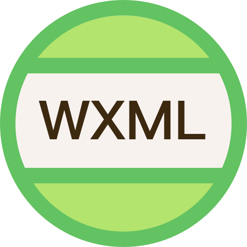

<p align="center"><a href="https://github.com/wx-minapp/minapp-vscode" target="_blank" rel="noopener noreferrer"></a></p>

[](https://github.com/wx-minapp/minapp-vscode/actions/workflows/ci.yml?query=branch%3Amaster)
[](https://github.com/wx-minapp/minapp-vscode/actions/workflows/deploy.yml)
[](https://marketplace.visualstudio.com/items?itemName=qiu8310.minapp-vscode)


## WXML - Language Services
> 插件原名`minapp`,现已更名为`WXML - Language Services`, 未来将持续专注微信原生小程序wxml的支持

微信小程序.wxml文件代码高亮，标签、属性的智能补全（同时支持原生小程序、mpvue 和 wepy 框架，并提供code snippets）

### 最近更新 【[CHANGELOG.md](https://github.com/wx-minapp/minapp-vscode/blob/master/CHANGELOG.md)】
> [@iChenLei](https://github.com/ichenlei)已接手维护本插件，欢迎大家来[issues区](https://github.com/wx-minapp/minapp-vscode/issues)提意见。

### 主要功能

* [标签名与属性自动补全](#tag-and-attr)
* [根据组件已有的属性，自动筛选出对应支持的属性集合](#smart-attr)
* [属性值自动补全](#attr-value)
* [点击模板文件中的函数或属性跳转到 js/ts 定义的地方（纯 wxml 或 pug 文件才支持，vue 文件不完全支持）](#attr-definition)
* [样式名自动补全（纯 wxml 或 pug 文件才支持，vue 文件不完全支持）](#attr-class-value)
* [在 vue 模板文件中也能自动补全，同时支持 pug 语言](#vue)
* [支持 link（纯 wxml 或 pug 文件才支持，vue 文件不支持）](#link)
* [自定义组件自动补全（纯 wxml 文件才支持，vue 或 pug 文件不支持）](#custom-component)
* [模板文件中 js 变量高亮（纯 wxml 或 pug 文件才支持，vue 文件不支持）](#highlight)
* [内置 snippets](#snippets)
* [支持 emmet 写法](#emmet)
* [wxml 格式化](#wxml-formatter)

> **所有自动补全的模板数据都来自于官方文档，通过[脚本](https://github.com/wx-minapp/minapp-generator)自动获取的**


<a id="tag-and-attr"></a>

### 标签名与属性名自动补全

* wxml 中需要输入 `<` 才会触发标签补全，而 pug 语言只需要写标签开头即能触发标签补全
* 输入空格会触发对应标签的属性补全


<a id="smart-attr"></a>

### 根据组件已有的属性，自动筛选出对应支持的属性集合

- 当 picker 的 mode="selector" 时，有 `range` 和 `range-key` 的属性
- 当 picker 的 mode="time" 时，有 `start` 和 `end` 的属性


<a id="attr-value"></a>

### 属性值自动补全（有可选值的情况下才会触发补全）

- 在属性值中输入空格可以触发，补全后自动会将空格覆盖


<a id="attr-definition"></a>

### 点击模板文件中的函数或属性跳转到 js/ts 定义的地方（纯 wxml 或 pug 文件才支持，vue 文件不完全支持）

**功能还不完善，只会查找和当前模板同名的脚本文件，所以有可能会找不到JS中的定义**


<a id="attr-class-value"></a>

### 样式名自动补全（纯 wxml 或 pug 文件才支持，vue 文件不完全支持）

系统会自动获取和当前模板同名的样式文件中的所有样式名，同时还能获取样式名上的 `/** */` 中的文档；如果有全局的样式，需要通过配置项 `minapp-vscode.globalStyleFiles` 来指定


- 默认会获取和当前模板同名的样式文件中的名称

  **注意：如果样式文件是 `@import` 了另一个样式文件，则程序不会去获取这个引入的文件中的样式名**

- 另外可以使用 `minapp-vscode.globalStyleFiles` 来指定一些全局的样式文件，这样在输入 `class=""` 后就也会出现这些文件中的样式名

  **小程序的 app.wxss 一般是全局的样式，所以需要你手动通过此配置来指定，如配置 `minapp-vscode.globalStyleFiles: ["src/app.wxss"]`**

- 另外也可以使用 `minapp-vscode.styleExtensions` 来指定系统使用的样式文件的后缀

  **建议配置此项，系统默认会查找各种后缀的样式文件，为避免不必要的性能损耗，最好配置成项目中使用的后缀！**

> **注意：不支持 `sass` 这种缩进排版的样式文件**


<a id="vue"></a>

### 在 vue 模板文件中也能自动补全，同时支持 pug 语言

vue 中的 template 板支持两个属性：

1. `lang` 可以设置为 `"wxml"` 或 `"pug"`，表示使用的语言（**在类 vue 框架中指定 `lang` 属性可能会导致编译报错，你可以使用 `xlang` 替代，但这样会同时出现 vue 和 minapp 的补全**）
2. `minapp` 可以设置为 `"native"`, `"wepy"`，`"mpx"` 或 `"mpvue"`，表示使用的框架，默认为 `"mpvue"`

如:

* `<template lang="wxml" minapp="native">`   表示使用 wxml 语言，不使用任何框架
* `<template lang="pug" minapp="mpvue">`     表示使用 pug 语言，并使用 mpvue 框架

> 注意，[mpvue 中指定 lang="wxml" 会报错](https://github.com/Meituan-Dianping/mpvue/issues/208)，需要等待作者修复！不过
> 你可以临时使用 `xlang="wxml"`，但这样同时也会触发 vue 的自动补全

指定为不同的 minapp 值会触发对应框架的自动补全，由于本人没有使用 wepy 和 mpvue 开发过，所以这些自动补全是根据官方文档说明而加上的，如果有错误，欢迎 PR（只需要修改文件 [src/plugin/lib/language.ts](https://github.com/wx-minapp/minapp-vscode/blob/master/src/plugin/lib/language.ts))


<a id="link"></a>

### 支持 link（纯 wxml 或 pug 文件才支持，vue 文件不支持）

- 默认只会 link src 标签，并且文件需要存在，不存在不会加 link
- 可以配置 `minapp-vscode.linkAttributeNames` 来扩展额外的支持 link 的标签，将此值配置成空数组，可以禁用 link 功能
- 可以配置 `minapp-vscode.resolveRoots` 来使用相对目录解析图片路径


<a id="custom-component"></a>

### 自定义组件自动补全（纯 wxml 文件才支持，vue 或 pug 文件不支持）

- 自动获取对应 json 文件中的组件信息
- 优先提示自定义组件
- 自动获取组件中属性的描述


<a id="highlight"></a>

### 模板文件中 js 变量高亮（纯 wxml 或 pug 文件才支持，vue 文件不支持）

- 默认关闭高亮，可以配置 `minapp-vscode.disableDecorate` 为 `true` 来开启高亮
- 默认高亮颜色使用紫色，可以配置 `minapp-vscode.decorateType` 来使用你喜欢的颜色，如 `{"color": "red"}`
- 默认会将 "{{" 与 "}}" 之间的所有字符都高亮，可以配置 `minapp-vscode.decorateComplexInterpolation` 为 `false`，这样只有变量（如：`foo`, `foo.prop`, `foo[1]`）会高亮，而表达式（如：`foo + bar`, `foo < 3`）不会高亮，而使用原本的颜色


**为了加快解析速度，颜色高亮使用的是正则表达式匹配，所以可能会出现匹配错误的情况；如果不满意，可以配置 `minapp-vscode.disableDecorate` 来禁用颜色高亮功能**

**已知问题：**

- pug 语言中注释中的变量也会高亮 （pug 是基于缩进的，正则不太好处理）


<a id="snippets"></a>

### 内置 snippets

  - 自带 swiper/icon/button/picker time/picker date/picker region/checkbox-group/radio-group，见[文件](https://github.com/wx-minapp/minapp-vscode/blob/master/src/plugin/res/snippets.ts)
  - 可以通过配置项 `minapp-vscode.snippets` 来定义你自己的 snippets

  _和官方的 Snippets 的区别时，这里的 Snippets 只需要指定 key 和 body 即可，组件描述自动会根据 key 来获取（另外后期可以让配置和内置的数据结合起来）_

  


<a id="emmet"></a>

### 支持 emmet 写法


[emmet cheat sheet](https://docs.emmet.io/cheat-sheet/)

<a id="wxml-formatter"></a>

### wxml 格式

支持`prettyHtml`和`prettier`(部分内容需要采用兼容html的方式书写)

* 默认 `wxml`
```jsonc
"minapp-vscode.wxmlFormatter": "wxml", //指定格式化工具
```
* [prettyHtml](https://github.com/Prettyhtml/prettyhtml#prettyhtmldoc-string-options-vfile)
```jsonc
"minapp-vscode.wxmlFormatter": "prettyHtml", //指定格式化工具
"minapp-vscode.prettyHtml": { //prettyHtml 默认配置
  "useTabs": false,
  "tabWidth": 2,
  "printWidth": 100,
  "singleQuote": false,
  "usePrettier": true,
  "wrapAttributes": false, //设置成 true 强制属性换行
  "sortAttributes": false
}
```
* [prettier](https://github.com/prettier/prettier)
```jsonc
"minapp-vscode.wxmlFormatter": "prettier", //指定格式化工具
"minapp-vscode.prettier": { //prettier 更多参考https://prettier.io/docs/en/options.html
 // 需指定wxml 的 parser, 推荐 angular 进行处理
  "useTabs": false,
  "tabWidth": 2,
  "printWidth": 100,
  "singleQuote": false
}
```
* tips:
  1. 针对`prettyHtml`,和`prettier`方式,会自动读取项目下的配置文件, [Prettier configuration file](https://prettier.io/docs/en/configuration.html) `.editorconfig`
  2. 切换格式化工具需重启vscode
  3. 针对`prettyHtml`,和`prettier`采用html5的语法和wxml不完全一致,写法要注意兼容

### 常见问题

#### 安装插件后没有出现自动补全

1. 确保安装后有重启过 vscode
2. 确保当前文件的格式是 wxml 或 wxml-pug 或 vue (不能看文件后缀名，因为可能在配置文件中把它们关联的其它文件格式；需要看 vscode 右下解显示的文件类型)

#### 在非小程序项目，pug 文件不想要小程序的自动补全

minapp 插件会自动将 .pug 文件关联到 `wxml-pug` 文件类型。所以你只需要在具体的项目中配置一下文件关联就行了。

* 非小程序项目中，将 .pug 后缀的文件关联到 `pug` 文件类型
* 小程序项目中，将 .pug 后缀的文件关联到 `wxml-pug` 文件类型


### TODO

* [x] 单独的 wxml 文件样式实现和 vue 中的 wxml 文件样式一样的风格
* [x] bind 或 catch 相关的属性可以点击，并跳转到对应的函数上
* [x] 自动创建文件关联（.cjson, .wxss, .wxs）
* [ ] wxml 文件中路径自动补全
* [ ] app/page/component 的 json schema 自动关联
* [x] 添加常用的 snippets
* [x] 支持识别 self close tag


[travis-image]: https://travis-ci.org/wx-minapp/minapp-vscode.svg?branch=master
[travis-url]: https://travis-ci.org/wx-minapp/minapp-vscode
